

# 🐾 Rafeeq

**Your Trusted Pet Guide**

*Built with Flutter & Dart*

---

## 📖 About

**Rafeeq** is a pet care & encyclopedia app that helps you learn everything about your animals — from feeding guides and lifespan info to expert care tips. Browse animal guides, save your favorites, and manage your profile, all in one clean experience.

---

## 📦 Packages Used

| Package | Description |
|---|---|
| [`flutter_svg`](https://pub.dev/packages/flutter_svg) | Render SVG icons and assets |
| [`gap`](https://pub.dev/packages/gap) | Easy spacing between widgets |
| [`go_router`](https://pub.dev/packages/go_router) | Declarative routing & navigation |
| [`smooth_page_indicator`](https://pub.dev/packages/smooth_page_indicator) | Smooth animated page indicators |

---

## 📱 Screenshots

<table>
  <tr>
    <td align="center"><b>Splash</b></td>
    <td align="center"><b>Onboarding 1</b></td>
    <td align="center"><b>Onboarding 2</b></td>
    <td align="center"><b>Onboarding 3</b></td>
  </tr>
  <tr>
    <td>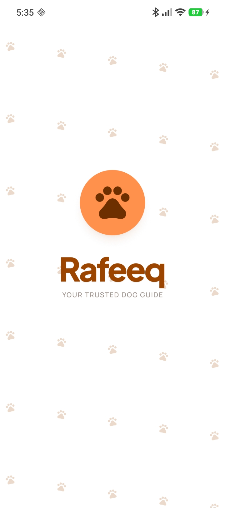</td>
    <td>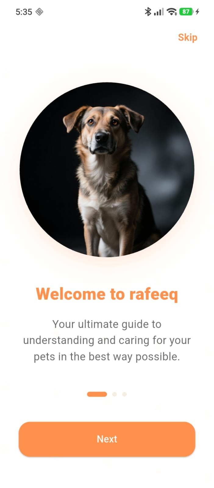</td>
    <td>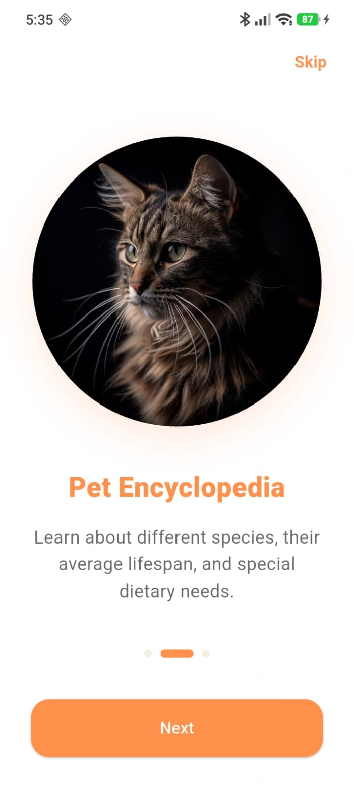</td>
    <td>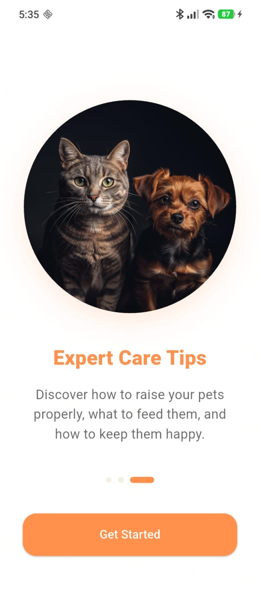</td>
  </tr>
  <tr>
    <td align="center"><b>Login</b></td>
    <td align="center"><b>Register</b></td>
    <td align="center"><b>Home</b></td>
    <td align="center"><b>Guides</b></td>
  </tr>
  <tr>
    <td>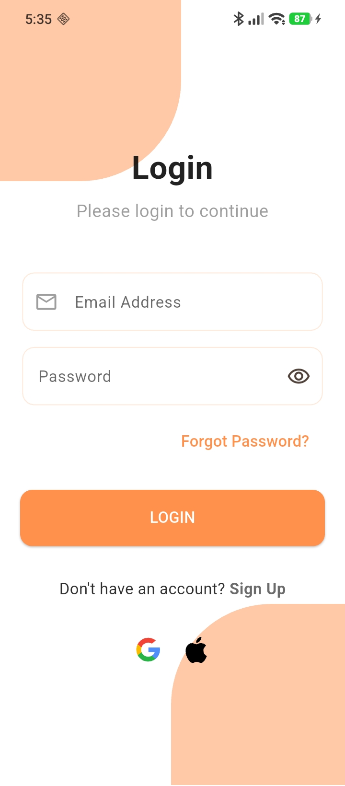</td>
    <td>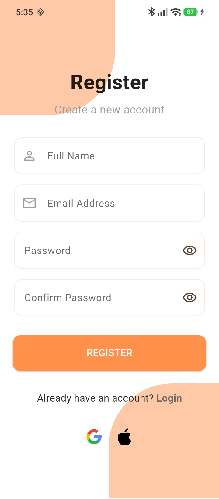</td>
    <td>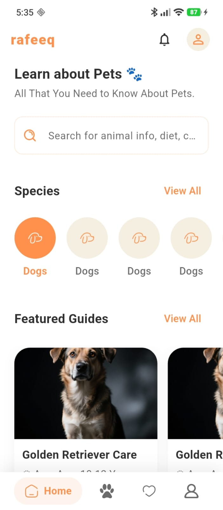</td>
    <td>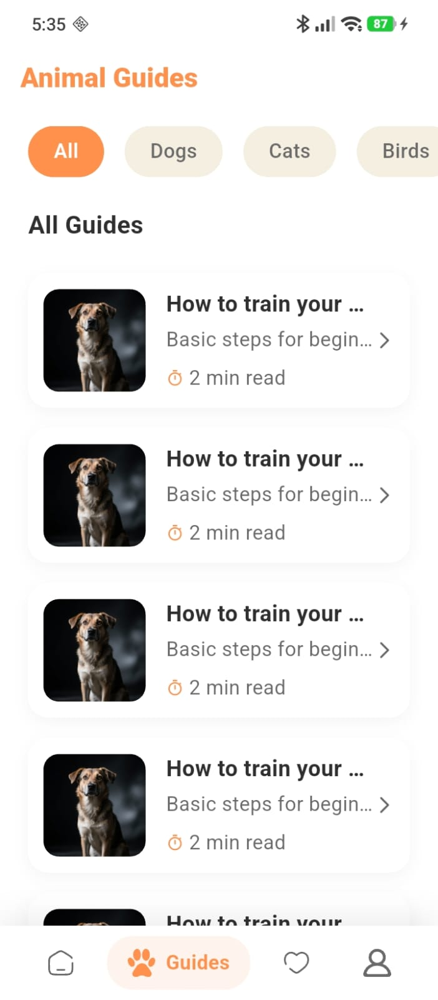</td>
  </tr>
  <tr>
    <td align="center"><b>Guide Details</b></td>
    <td align="center"><b>Favorites</b></td>
    <td align="center"><b>Profile</b></td>
    <td align="center"><b>Edit Profile</b></td>
  </tr>
  <tr>
    <td>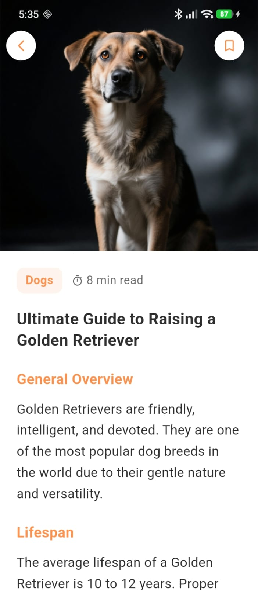</td>
    <td>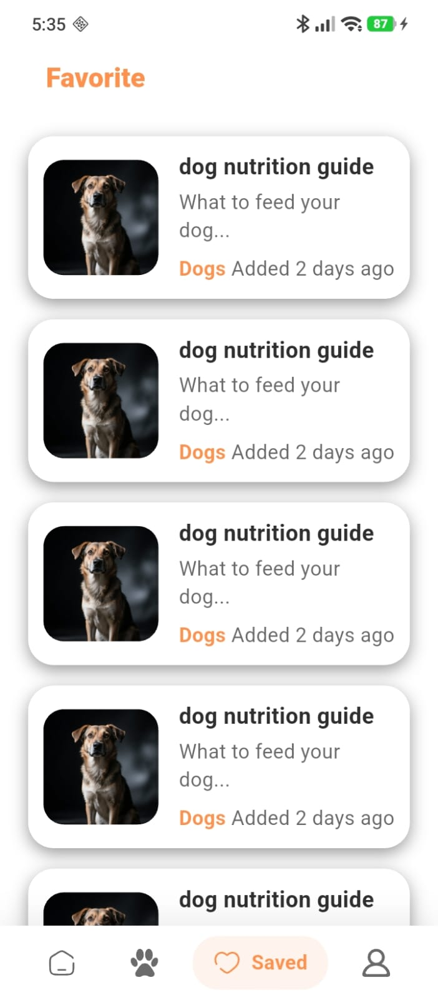</td>
    <td>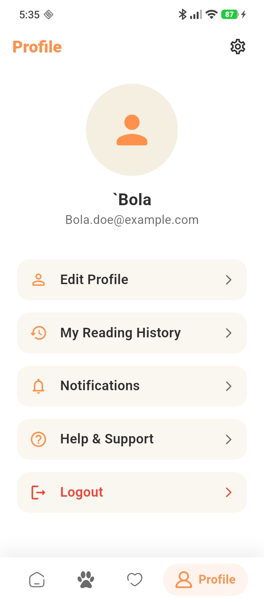</td>
    <td>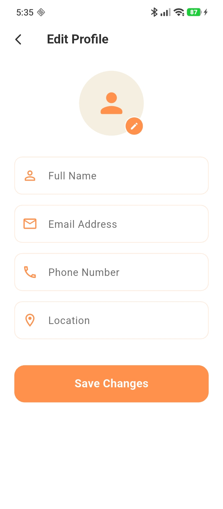</td>
  </tr>
  <tr>
    <td align="center" colspan="2"><b>Settings</b></td>
    <td align="center" colspan="2"><b>Search</b></td>
  </tr>
  <tr>
    <td colspan="2" align="center"></td>
    <td colspan="2" align="center">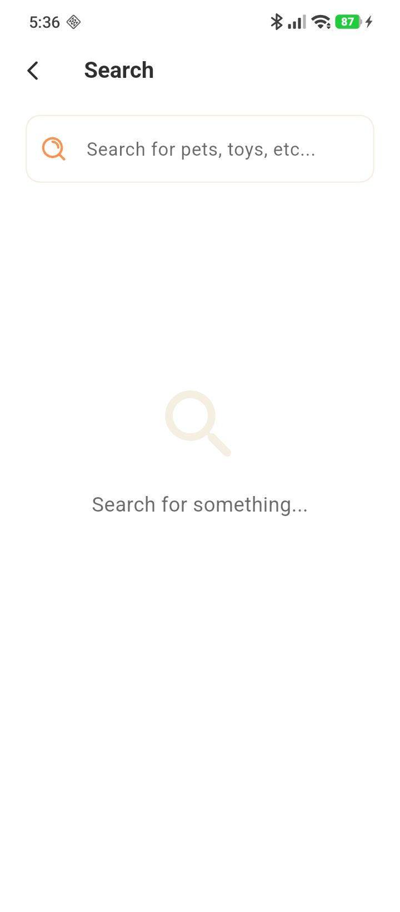</td>
  </tr>
</table>

---

---

Made with ❤️ using Flutter & Dart

